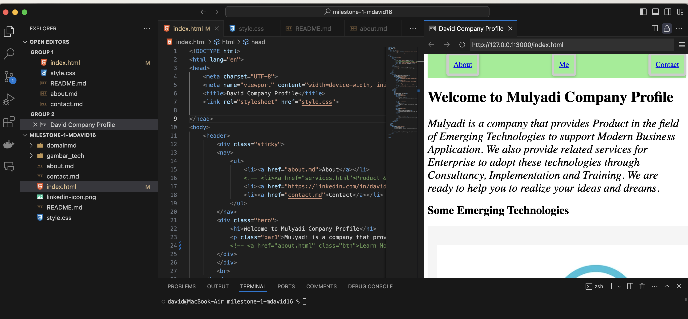
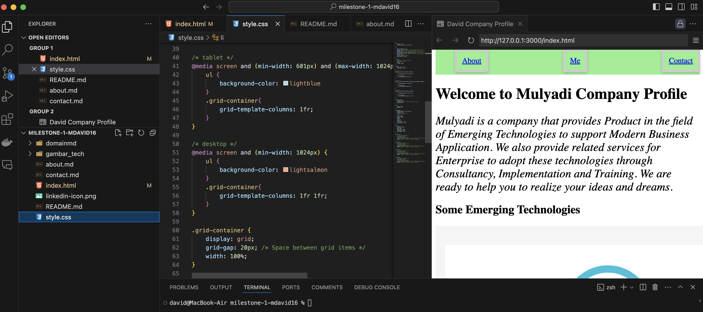
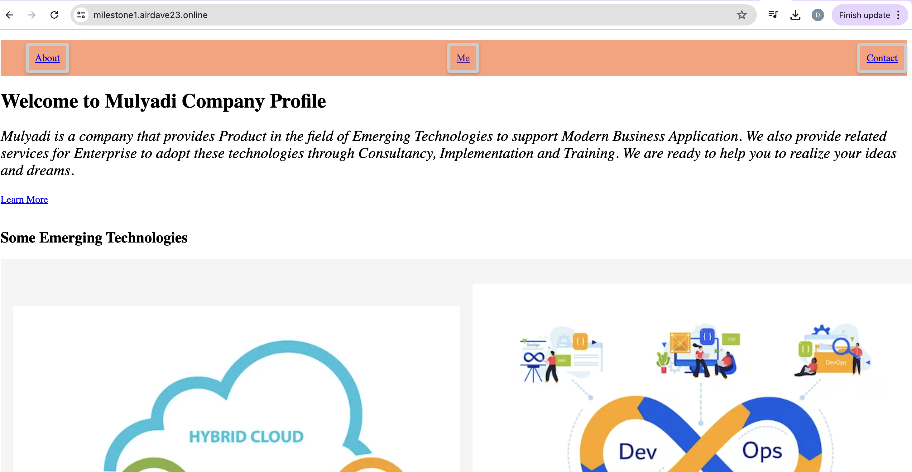

# Proses membangun site dari awal :
1. Membuat html file (index.html) beserta asset2 yang diperlukan seperti media 
   
   

2. Membuat css file (style.css) untuk membuat sytle dari html site mulai dari warna, posisi, display, dsb nya

    

3. Membuat Git repository baik di lokal maupun remote (dengan github.com) yang nantinya dideploy website dengan menggunakan netlify dengan koneksi ke github

4. Menyiapkan domain (airdave23.online) untuk hosting website dari netlify agar dapat diaksek melalui public internet secara secure 

5. Setup subdomain (milestone1.airdave23.online) sebagai landing page dari website yang dibuat

    

# Deployment Consideration
Masih menggunakan basic html dan css sebagai main tools dalam membangun website yang dideploy di netlify dan domain registrar niagahoster 